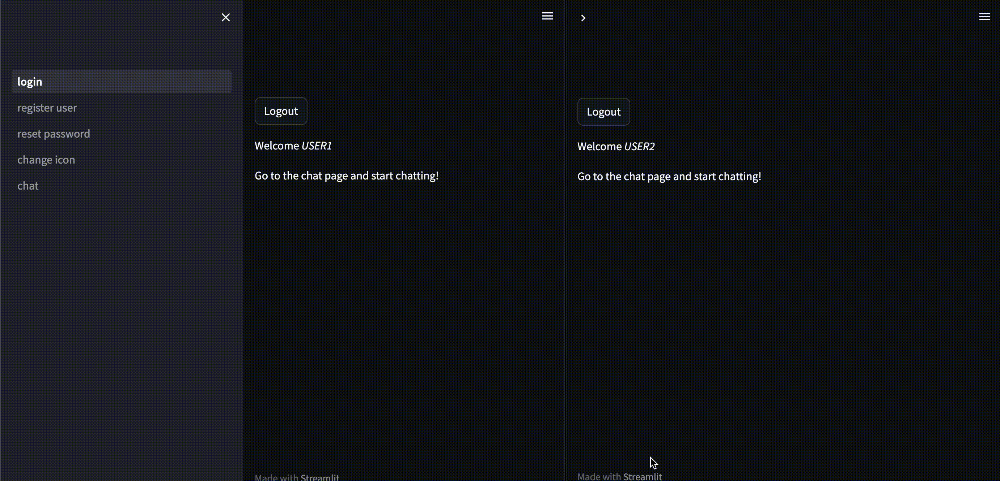

# StreamlitChatAppDemo


Chat sample code between users using Streamlit.

This project will be the code to chat between users by Streamlit.
Since it is the minimum necessary content, please modify it as necessary and use it.

Demo is as follows.


## Install

```bash
pip install -r build/requirements.txt
```

### Docker

If you want to run with Docker, please build the image with the following command.
```bash
docker build -t streamlit_chat_app_demo build
docker run -it --rm -p 8501:8501 -v $PWD:/home/workspace --name streamlit_chat_app_demo streamlit_chat_app_demo bash
```

## Setting

The setting value of this code can be changed from the following setting file.
* [src/const.py](src/const.py)

You can configure the following settings.
* Local DB file path where user information and chat logs are saved.
* The path where the user's icon image is saved.
* Contents related to the Admin user registered as the initial user.
* Contents of cookies.
* The upper limit of the number of chats displayed and the refresh interval of the chat screen.


## Run

```bash
streamlit run src/01_login.py
```
If successful, the following log will be output.
```
  You can now view your Streamlit app in your browser.

  Local URL: http://localhost:8501
  Network URL: http://xxxx.xxxx.xxxx.xxxx:8501
```

During execution, you can check the demo screen from the following page.  
http://localhost:8501


## How to use

1. Register as a user from the "register user" page.  
    If the login is successful, the following message will be displayed.  
    ```User registered successfully. Please login to continue.```  
    User information is registered in the local DB.  
    Also, the user set in setting file is registered as an initial user.  
    The email address is not used for anything, so anything suitable is fine.  
2. Log in as a registered user from the "login" page.  
    A message similar to the one below is displayed.  
    ```Welcome [user name].```  
3. If necessary, register your own icon image from the "change icon" page.  
    Icon images are saved in the folder specified in setting file.  
4. Chat from the "chat" page.  

## Add characters by ChatGPT(gpt-3.5-turbo) to chat

Procedure if you want to add a character by ChatGPT to chat.

## Run

```
export OPENAI_API_KEY="YOUR_API_KEY"
streamlit run src/01_login.py -- --use_chatbot
```

## How to use

It's basically the same as normal chat, but you can set your character's personality from the "set character" page.  
When you send a message in chat, the character will reply.  